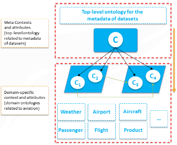
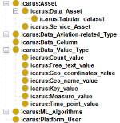
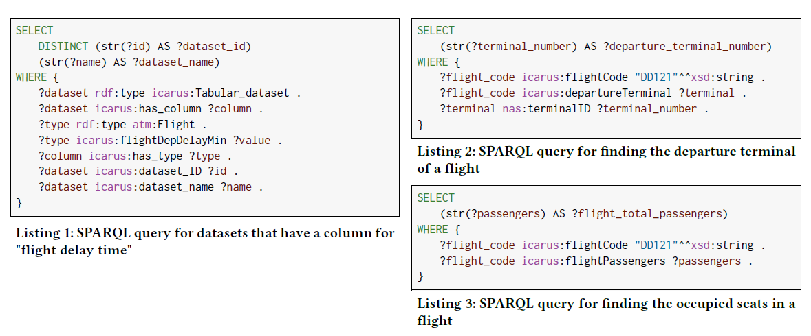

# Icarus Ontology
## Overview
The ICARUS ontology aims at facilitating the semantic description and integration of information resources that represent the various assets of the ICARUS platform (https://www.icarus2020.aero) and their use. To this end, the ontology enables the integration and reasoning over multiple sources of heterogeneous aviation-related data and the semantic description of metadata produced by ICARUS. More specifically, the core uses of the ICARUS ontology are: 
* To facilitate the semantic annotation of datasets in order to capture the structural and semantic characteristics of the various entities in each given dataset.
* To represent semantically other entities of the ICARUS platform such as service assets, deployed algorithms and their popularity, assets popularity and user's interactions.
* To drive the extraction of metadata from ICARUS platform operations, their semantic representation, and their storage in the ICARUS knowledge-base.
* To support the continuous integration of new datasets, services, and human experts into the platform.
* To support the search and query over multiple data sources and information assets available on ICARUS and on other open aviation-related datasets, such as open data, epidemics data and data extracted from Twitter or other online social networking sites.
* To provide an application-programming interface to feed the algorithms of the ICARUS recommendation engine with useful information.
For the development of the ontology, the Protégé software tool and the OWL/XML syntax have been used.

## Multi-layer Approach for the Ontology Development
For the ICARUS ontology we use a multi-layer approach so that the ICARUS ontology can represent both metadata and aviation-specific concepts. As displayed in Figure 1, the top-level ontology (C ontology) describes the meta-contexts and attributes related to metadata of datasets and allows the addition of specific domain context ontologies. Other independent aviation domain ontologies (i.e. C1, C2, C3, C4) can be included under the top-level ontology (and even extend the ontology) to describe various (aviation-related) concepts. The entities and properties of each independent domain ontology should be integrated with the rest of the domain ontologies that are incorporated under the top-level ontology.

In our case, C1, represents the NASA ontology which has been selected since it includes most of the concepts related to aviation. The NASA ontology has been incorporated under the top-level ontology and it has been expanded with new concepts, data fields and relationships. The representative entities modeled within the NASA ontology are the following: Flight (e.g. flight plans and radar flight tracks, etc.), Aircraft and manufacturers (e.g. aircraft characteristics, models, etc.), Airport and infrastructure (e.g. runways, taxiways, terminals, gates, etc.), Airline (e.g. air carrier name, country of registry, etc.) and entities that represent air traffic management initiatives (TMIs) (e.g. ground delay programs, ground stops, reroutes, etc.). The new concepts that expand the NASA ontology have been incorporated under the ICARUS domain ontology (i.e. Icarus extra properties).

Another ontology that we used is the Epidemiology Ontology (EPO), which describes epidemiologically relevant concepts such as transmission mode, epidemiological parameters and demographic parameters. It contains concepts that could facilitate the linking between epedimiological data and aviation-related data. By improving the level of detail and the linking capabilities between aviation-related data and health-related data is likely to lead to more accurate epidemic predictions. The EPO ontology has been incorporated under the top-level ontology (C3) and it has been expanded with new data fields and relationships that connect the aviaton-related entities with the concepts related to aviation (e.g. flights). Finally, the new concepts that expand the EPO ontology have been incorporated under the ICARUS domain ontology (i.e. Icarus extra properties).

The multi-layer approach has many benefits such as: a) Modularity and interoperability: The ontology is organized in a modular manner since the top-level ontology and each independent domain ontology are arranged in different modules, which facilitates the ontology's maintenance and extendibility and b) Flexibility/Scalability: The multi-layer approach ensures maximum ease of use for retrieving and querying data. d) Usability: Recommendation which involves the development of algorithms and software for supporting the selection of the most appropriate datasets that best matches the user's preferences.

	
    
<strong>Figure 1: Multi-layer approach of the ICARUS ontology where C is the top-level ontology and C1 - C4 are independent aviation domain ontologies</strong>

## Definition of Classes and Class Hierarchy
The ICARUS ontology contains a total of 382 classes, 151 object properties and 450 data properties. The top-level ontology consists of 16 new classes, as displayed in Figure 2, while it consists of six main representative entities, which have been introduced to the ICARUS ontology:
* Asset: This class represents the generalized entity of a data or a service asset. It consists of properties that describe different types of assets e.g. license, publication date, title, description, categories, etc.
* Data Column: This class represents the column id of the columns on each provided data asset. Furthermore, it contains attributes that describe the quality of a data column e.g. percentage of missing values, percentage of duplicate values, etc. 
* Data Aviation-related type: This class represents the generalized structure of defining the possible columns that can be provided in any aviation-related data asset e.g. Aircraft, Airport, Flight, Bond etc.
* Data Value type: This class would be useful for enabling the ICARUS ontology to semantic annotate data instances of diverse format types. It represents the general value types that the instances of the corresponding columns of an aviation-related data asset can take e.g. count value, free text values, geo coordinates value, geo name value, key value, measured value and time point value.
* ML Algorithms: This class represents the machine learning algorithms that are available in the ICARUS platform. Furthermore, it is connected with the service assets, as each service can contain one or more machine learning algorithm(s), and with the users in order to obtain usage statistics for each algorithm.
* Platform User: This class represents the users of the ICARUS platform. It consists of data properties like organization's name and preferences, and object properties that describe several relationships between users, assets and algorithms e.g. userViewedAsset, userPurchasedAsset, etc.

	
    
<strong>Figure 2: ICARUS Ontology Class Hierarchy</strong>

## ICARUS Ontology Extension
The ontology represents a dynamically changing representation of the evolving aviation data landscape that can easily be extended and updated. To extend the ICARUS ontology, new individual domain ontologies could be added under the top-level ontology. For example, existing domain ontologies from diverse aviation-related domains such as transportation, tourism or health can be added as independent domain ontologies (C3, C4, C5 ...) and their entities/properties can be connected to some of the already incorporated domain ontologies (C1 - C2,..).

## Evaluation
To evaluate the ICARUS ontology, we used SPARQL queries to answer a sample of the competencies questions:
* Question 1: Which datasets contain columns about flight delay time?
To answer Question 1, we run the SPARQL query, as displayed in Listing_1. The result of Question 1 is the dataset Dataset_1: Delayed flights.
* Question 2: Which is the airport departure terminal for a specific flight?
To answer Question 2, we run the SPARQL query, as displayed in Listing_2. The result of Question 2 is the departure terminal number: 3.
* Question 3: How many were the occupied seats on a specific flight?
To answer Question 3, we run the SPARQL query, as displayed in Listing_3. The result of Question 3 is the total number of 150 flight passengers.

	
    
<strong>Figure 3: SPARQL Queries</strong>

## Use-cases
* Representation and modelling of aviation data
* Representation and modelling of aviation-related data from social networks
* Representation and modelling of assets (data or service assets) related to epidemics (e.g. COVID-19)
* Utilize the ICARUS ontology for providing high-quality recommendations of datasets and services based on user’s preferences

## How to use
* Download the **ICARUS Ontology project**
* Open / Import the *"ICARUS_Ontology.owl"* file using **Protégé**.

## License
The ICARUS ontology is made available under the MIT License.

## Citation
Stefanidis, Dimosthenis, Chrysovalantis Christodoulou, Moysis Symeonidis, George Pallis, Marios Dikaiakos, Loukas Pouis, Kalia Orphanou, Fenareti Lampathaki, and Dimitrios Alexandrou. "The ICARUS Ontology: A general aviation ontology developed using a multi-layer approach." In Proceedings of the 10th International Conference on Web Intelligence, Mining and Semantics, pp. 21-32. 2020.